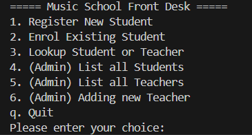

# 🎵 School Music Management System

This is a Python terminal-based application to manage the front desk operations of a music school. This management system allows registration and enrollment of students, management of teachers' information, and search functionalities.

---

## ✨ Features

- 📝 Register new students  
- 🎶 Enroll students in instrument classes  
- 👩‍🏫 Add new teachers  
- 📋 List all teachers and students in the system  
- 🔍 Search for students and teachers by name  
- 🆔 Search for students by ID and teachers by specialty  

---

## 📁 Description of Fragments

### 🔹 Fragment 1

- Create two classes (`Student` and `Teacher`) as blueprints to hold data  
- Create two databases (lists) to store students' and teachers' information  

### 🔹 Fragment 2

- Develop three fundamental functions:  
  1. **Add new teacher to the database**: Define a function to store teacher info (name, ID, specialty)  
  2. **List students**: Define a function to display student info (name, ID, enrollments)  
  3. **List teachers**: Define a function to display teacher info (name, ID, specialty)  

### 🔹 Fragment 3

- Add new functionality:
  1. **Find student by ID**: Allow users to search for a student by ID  
  2. **Front desk registration**: Allow students to register with their name, student ID, and enrollment  
  3. **Student enrollment**: Add instruments for a student  
  4. **Advanced search**: Search for teachers or students using any related keyword  

### 🔹 Fragment 4

- Develop a main menu interface  
- The system is now fully functional and ready to run  

---

## How to run the program

- While the program runs, it will show a menu first
- User and enter number 1-6 or letter "q" to do decision
- After every action, the menu will be shown again
- The program will always be ran unless the user enter "q"
- If user enter neither number 1-6 nor "q", then remind it is invalid input and show the menu again

---

## Self design and choices
- 1. Every student was assgined a unique 8 digit student ID (e.g 12345678)
- 2. Error handling to ensure the validity student ID entered while either enrollment or registeration 
- 3. Making the output of list more cleaner
- 4. Adding new teacher registeration function

---

## Reminder
- 1. Please ensure your python version is 3.X.X
- 2. Currently, data is stored in-memory (no database file), so it resets on every run

## Contact
Created by Wong Kai Heng
GitHub: [Wong Kai Heng](https://github.com/WongKH1010)
