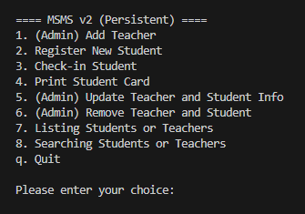

# 🎵 School Music Management System v2 (Persistent)

This is a Python terminal-based application to manage the front desk operations of a music school, with **data persistence using JSON files**.  
The system allows registration of students, management of teachers and students information, student attendance tracking, and search functionalities.

---

## ✨ Features

- 📝 **Register new students**  
- 🎶 **Enroll students**  
- 👩‍🏫 **Add new teachers**  
- 📋 **List all teachers and students**  
- 🔍 **Search**  
- 🆔 **View student cards**  
- 🗑 **Remove**  
- 🛠 **Update**  
- 🕒 **Record attendance**  
- 💾 **Persistent data storage**  

---

## 📁 Description of Core Components

### 🔹 Data Management
- **`load_data()`**: Loads data from a JSON file or initializes a default structure if the file doesn’t exist  
- **`save_data()`**: Saves all changes back to the JSON file  
- **Global Structure**: Stores `students`, `teachers`, `attendance`, and auto-increment counters `next_student_id` & `next_teacher_id`  

### 🔹 Validation Utilities
- **Check by Name/ID**: Functions to validate whether a student or teacher exists  
- **Password Checks**: Separate admin and student/teacher passwords for access control  

### 🔹 Core Functions
1. **Add Teacher** — Add new teacher records with specialty  
2. **Register Student** — Register new students with initial enrollment  
3. **Update** — Modify names, specialties, or student enrollments  
4. **Remove** — Delete records after confirmation  
5. **List Records** — Display teachers or students list in a neat, tabular format  
6. **Attendance Tracking** — Record course check-ins for students  
7. **Print Student Card** — Generate an ID badge file for each student  

### 🔹 Lookup Features
- **Find Student** by ID or name  
- **Find Teacher** by ID or name  

---

## 📟 Main Menu Interface

When the program starts, a menu will appear:



---

## 💡 Self Design and Choices
1. **`Alignent`**: Making the `listing` of either **students** or **teacher** more cleaner  
2. **`Security Advancement`**: Assign a `password verification` for `Admin-Only` features and **student** password is limited  
3. **`Functionalities`**: Added similar functionalities from PST1 such as `lookup` features and `listing` features  
4. **`Validation`**:  Added some new `validation checking` function as doing checking in every choices did by user to make sure the **term** enter is **valid**
5. **`Lookup functions`**: Added **lookup** functions to be used in some particular choices to let the users know which `profile` are user managing
6. **`Beautify menu`**: Catogarize the features with its function only and let the user to do decision which group (**teacher** or **student**) is the feature facing to avoid the menu be too long

---

## 🚀 How to Run
- While the program runs, it will show a `menu` first
- User and enter number 1-8 or letter **`q`** to do decision
- After every action, changes are automatically saved to `msms.json` and the menu will be shown again
- The program will always be ran unless the user enter **`q`**
- If user enter neither number 1-6 nor **`q`**, then remind it is invalid input and show the menu again

## ⚠️ Reminders
1. Ensure **Python 3.x** is installed on your system  
2. Save the script and run:
    ```bash
    python msms_v2.py

## 📬 Contact
Created by `WONG KAI HENG`  
GitHub: [Wong Kai Heng](https://github.com/WongKH1010)  
Email: kwon0175@student.monash.edu