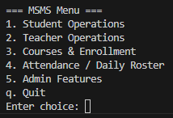
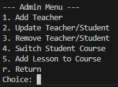
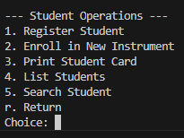
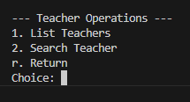

# 🎵 Music School Management System v3 (OOP, Persistent)

This is a **Python terminal-based application** for managing the front desk and administrative operations of a music school, built using **Object-Oriented Programming** and **persistent JSON storage**.  

The system supports registration of students, management of teachers and courses, lesson scheduling, student attendance tracking, and lookup functionalities.

---

## ✨ Features

- 📝 **Register new students**  
- 🎶 **Enroll students in courses**  
- 👩‍🏫 **Add new teachers**  
- 📋 **List all teachers and students**  
- 🔍 **Search for teachers and students by ID or name**  
- 🆔 **Generate student ID cards**  
- 🗑 **Remove student or teacher records**  
- 🛠 **Update student or teacher information**  
- 🕒 **Record student attendance**  
- 📅 **View daily roster of lessons**  
- 📚 **Add lessons to courses**  
- 🔄 **Switch students between courses (Admin-only)**  
- 💾 **Persistent data storage in JSON**  

---

## 📁 Core Components

### 🔹 Data Management
- **`_load_data()`**: Loads existing data from JSON or initializes default structures.  
- **`_save_data()`**: Saves all changes back to the JSON file.  
- **Stored Data**: `students`, `teachers`, `courses`, `attendance`, and auto-increment counters `next_student_id` & `next_teacher_id`.

### 🔹 User Classes
- **`User`**: Base class for all users.  
- **`StudentUser`**: Inherits from `User`, stores enrolled courses.  
- **`TeacherUser`**: Inherits from `User`, stores specialty.  
- **`Course`**: Stores lessons and enrolled students.

### 🔹 Validation Utilities
- Functions to validate students/teachers by **ID or name**.  
- Password verification for **Admin-only** and **student-specific actions**.

### 🔹 Core Functionalities
1. **Register Student** — Add new students with initial course enrollment.  
2. **Check-in Student** — Record attendance for a course.  
3. **Print Student Card** — Generate a text badge file.  
4. **List Teachers/Students** — Neatly formatted tabular display.  
5. **Daily Roster** — View lessons for any day with teacher, time, and room.  
6. **Lookup Students/Teachers** — Search by ID or name.  

### 🔹 Admin-Only Features
- Password required to access these features:
1. **Add Teacher**  
2. **Update Teacher or Student info**  
3. **Remove Teacher or Student**  
4. **Switch Student Courses**  
5. **Add Lesson to Course**

### 🔹 Student-Password Features
- **Enroll new instrument/course** — Student password required.

---

## 📟 Menu Interface

- **Front Desk / General Menu**:



- **Admin Menu** (Password protected):



- **Student Menu** (Password protected):



- **Teacher Menu** (Password protected):



---

## 💡 Design Choices
1. **OOP Architecture**: Separates concerns with `User`, `StudentUser`, `TeacherUser`, `Course`, and `ScheduleManager`.  
2. **Persistent Data**: All operations automatically update `msms.json`.   
3. **Validation & Security**: Separate passwords for admin and student-specific actions, input validation included.  
4. **Find Utility**: Improve find utility as it can be used by entering either ID or name  
5. **Modular Menu**: Front desk, admin, and student options are grouped to keep the menu clean.
6. **Functionalities**: Added functions from previous PST to make it more complete.
7. **Additional features**: Added features such as `add_course`, `add_lesson_to_course`


---

## 🚀 How to Run
- While the program runs, it will show a `menu` first
- User and enter number 1-5 or letter **`q`** to do decision
- After every action, changes are automatically saved to `msms.json` and the menu will be shown again
- The program will always be ran unless the user enter **`q`**
- If user enter neither number 1-6 nor **`q`**, then remind it is invalid input and show the menu again

## ⚠️ Reminders
1. Ensure **Python 3.x** is installed.  
2. Save all code in the project folder.  
3. Run the main script:

    ```bash
    python main.py

## 📬 Contact
Created by `WONG KAI HENG`  
GitHub: [Wong Kai Heng](https://github.com/WongKH1010)  
Email: kwon0175@student.monash.edu